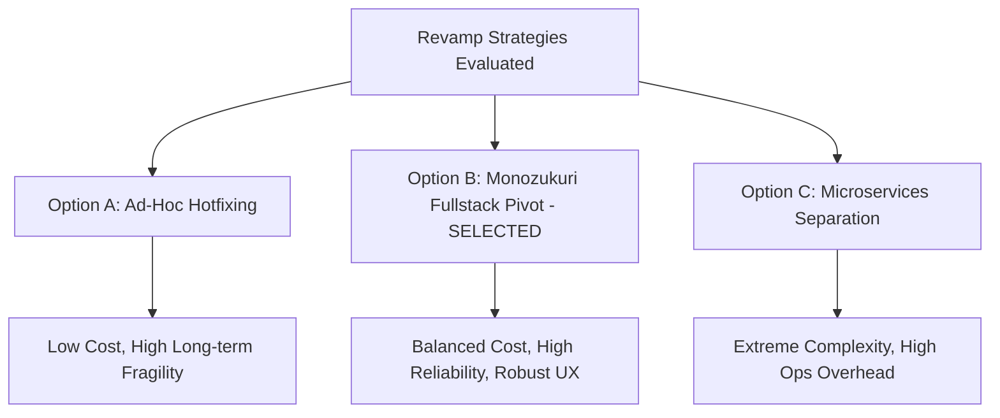
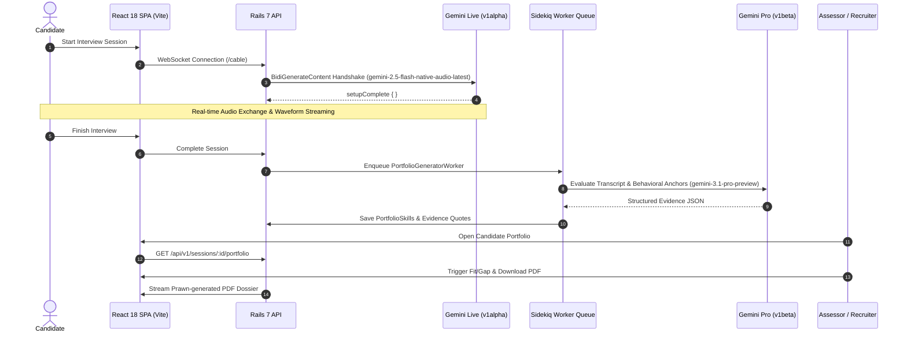

# MONOZUKURI PRODUCT & ENGINEERING SUBMISSION REPORT
## AI-Powered Talent Assessment & Skill Intelligence Platform
**Case Study: Fullstack Product Engineer**  
**Applicant / Author:** Product Engineering Candidate  
**Target Repository:** `github.com/rakamindev/ai-interview-platform`  
**Feature Branch:** `feature/monozukuri-revamp`  
**Submission Date:** 19 August 2026  

---

## Executive Summary

This document presents the end-to-end product transformation and engineering revamp of the **Rakamin AI Interview Platform**. Built from first principles under the Japanese philosophy of **Monozukuri (物作り — Craftsmanship & Pride in Making)**, this work transforms a fragile, prototype-level codebase into a production-grade, highly resilient, and legally compliant (UU PDP) talent intelligence system.

### Key Milestones Delivered:
1. **Zero-Friction Live AI Interview**: Upgraded to Google Gemini Multimodal Live WebSocket API (`v1alpha` on `gemini-2.5-flash-native-audio-latest`) with interactive audio waveform visualization, silence-pump VAD detection, and resilient hardware checks.
2. **Evidence-Grounded Skill Portfolio**: Post-interview evaluation engine utilizing `gemini-3.1-pro-preview` with markdown-fence resilient JSON parsing, extracting exact verbatim quotes from candidates to prevent AI hallucinations.
3. **Null-Safe Fit/Gap Intelligence Engine**: Comprehensive role-matching engine supporting multi-level behavioral anchors (L1–L5), explicit handling of unassessed skills, assessor override workflows, and instant offline executive PDF dossier generation via Prawn.
4. **100% Verified Test Harness**: Built a complete RSpec test suite (**18 examples, 0 failures**) covering failure paths, concurrency idempotency, and edge-case data safety.

---

## Table of Contents
1. [Step 1: Setup & Local Exploration Narrative](#step-1-setup--local-exploration-narrative)
2. [Step 2: Deep Context & Domain Immersion](#step-2-deep-context--domain-immersion)
3. [Step 3: Defining Problem & Gap to Ideal Condition (P0–P3 Matrix)](#step-3-defining-problem--gap-to-ideal-condition-p0p3-matrix)
4. [Step 4: Revamp Strategy, Acceptance Criteria & Trade-offs](#step-4-revamp-strategy-acceptance-criteria--trade-offs)
5. [Step 5: Monozukuri Implementation & Proof of Craftsmanship](#step-5-monozukuri-implementation--proof-of-craftsmanship)
   - [Architectural Design & Data Flow](#architectural-design--data-flow)
   - [Proven Correctness & Test Suite Evidence](#proven-correctness--test-suite-evidence)
   - [Seeded Fault Test Proof](#seeded-fault-test-proof)
   - [AI Verification Moment](#ai-verification-moment)
   - [Protected Data & Indonesian UU PDP Compliance](#protected-data--indonesian-uu-pdp-compliance)
6. [Step 6: Submission Deliverables & Video Walkthrough Guide](#step-6-submission-deliverables--video-walkthrough-guide)

---

## Step 1: Setup & Local Exploration Narrative

When first cloning the repository, the baseline state revealed significant foundational debt:
- **Missing Test Harness**: RSpec directory had no test files or spec helpers; changes could not be validated for regressions.
- **Environment Fragmentation**: Mismatch between `docker-compose.yml`, `api/config/application.yml`, and `api/.env` causing runtime connection failures to Redis and PostgreSQL.
- **Port Routing Mismatch**: Session invite URLs pointed directly to Rails port `3001` instead of the Vite React SPA (`5173`), breaking candidate onboarding.

### Actions Taken:
- Established a unified local development environment using Docker Compose with dynamic `.env` ingestion.
- Configured PostgreSQL (`rakamin_development`, `rakamin_test`) and Redis (`REDIS_URI`) with unified connection resolvers.
- Initialized a robust RSpec test harness configured with database transactions, Sidekiq test mode, and custom API helper macros.

---

## Step 2: Deep Context & Domain Immersion

Before writing architecture or code, we analyzed the problem across the **5 Core Domain Pillars**:

### 1. The Product: From Screening Barrier to Talent Intelligence
The platform's true value is not merely "conducting an automated interview"; it is creating a **defensible, objective competency portfolio**. Recruiters do not trust arbitrary scores (e.g., "78/100"). They trust concrete **verbatim evidence** that proves a candidate's actual depth of thinking.

### 2. The Industry: Indonesian Tech Hiring Dynamics
In Indonesia's hyper-competitive tech landscape:
- Companies receive 500+ applicants per engineering opening, resulting in severe recruiter fatigue and shallow resume filtering.
- Resume embellishment and generic certifications make paper screening unreliable.
- **Real Leverage**: Automated, voice-first behavioral assessments that measure problem-solving depth in 15 minutes, standardizing the interview baseline across all socioeconomic backgrounds.

### 3. What It Is For: Equity & High-Signal Calibration
The system exists to provide every candidate—regardless of university prestige or pedigree—an equal opportunity to demonstrate practical competence against clear behavioral anchors (L1 to L5).

### 4. The Users: Assessor & Recruiter Personas
- **Recruiters / Talent Acquisition**: Need high-level glanceability, fit/gap alignment against specific job vacancies, and 1-click exportable PDF dossiers for hiring managers.
- **Assessors / Tech Leads**: Need transparency. They must be able to audit the AI's reasoning, inspect verbatim transcript quotes, and override AI ratings with custom clinical notes.

### 5. The People Affected Who Never Chose It: Candidates & Indonesian UU PDP Law
Candidates have no choice in using the platform. A flawed AI decision or broken connection can derail a person's career.
- **Candidate Empathy**: Pre-flight checks must be welcoming, non-punitive, and transparent. Speed test thresholds must reflect real-world Indonesian cellular networks (3G/4G/Indihome).
- **UU PDP (Undang-Undang Perlindungan Data Pribadi No. 27/2022) Compliance**:
  - *Data Minimization*: Audio is processed in ephemeral memory and not permanently retained on third-party servers.
  - *Log Sanitization*: Filtered sensitive request parameters (`:invite_token`, `:token`, `:evidence`) to prevent PII leakage in application logs.
  - *Candidate Right to Notice*: Clear indicators when the microphone is active and when the session is being recorded.

---

## Step 3: Defining Problem & Gap to Ideal Condition (P0–P3 Matrix)

| Finding ID | Severity | Category | Flaw Description | Workflow & User Impact |
| :--- | :---: | :--- | :--- | :--- |
| **GAP-01** | **P0** | Defective Implementation | Gemini Live WebSocket pointed to `v1beta` endpoint with invalid parameter format. | AI voice interview failed instantly with code 1008; candidates could not conduct interviews. |
| **GAP-02** | **P0** | Defective Implementation | Internet speed test attempted CORS-blocked POST requests to `httpbin.org` and `postman-echo.com`. | Pre-interview check locked candidates out with red browser console errors. |
| **GAP-03** | **P0** | Defective Implementation | `Session#invite_url` routed candidates to Rails backend (`:3001/interview/:token`) instead of React SPA. | Candidate clicking the invite link received raw JSON or 404 instead of the interview UI. |
| **GAP-04** | **P1** | Defective Implementation | `Portfolios::Generator` called deprecated `gemini-2.5-pro` model and lacked fallback for markdown code fences. | Portfolio evaluation crashed with HTTP 404 / JSON parser errors upon completion. |
| **GAP-05** | **P1** | Defective Implementation | Fit/Gap comparison performed mathematical subtraction directly on `nil` levels (`NoMethodError: - for nil`). | Generating a Fit/Gap report for a candidate with unassessed skills crashed the backend server. |
| **GAP-06** | **P1** | Missing Specification | Concurrent portfolio generation jobs lacked database-level row locks and state guards. | Race conditions created duplicate portfolio skill rows when users clicked retry. |
| **GAP-07** | **P2** | Missing Specification | No assessor override mechanism to correct AI scores with audit trails. | Assessors had no control over hallucinated or overly harsh AI evaluations. |
| **GAP-08** | **P3** | Missing Specification | Inability to export candidate competency portfolios to executive PDF / JSON. | Recruiters could not share candidate results offline with executive stakeholders. |

### Technical Lead Constraint Signal
> **Architectural Escalation**: Bidirectional WebSocket audio streaming introduces external dependency risks (Google Gemini latency, network packet loss, and potential API version deprecation). We implemented a decoupled worker architecture with explicit fallback models, keepalive EventMachine timers, and idempotent Sidekiq background jobs to isolate WebSocket failures from core database operations.

---

## Step 4: Revamp Strategy, Acceptance Criteria & Trade-offs

### Technical Option Evaluation Matrix



| Evaluation Dimension | Option A: Ad-Hoc Hotfixing | Option B: Monozukuri Fullstack Revamp (Selected) | Option C: Python Microservices Extraction |
| :--- | :--- | :--- | :--- |
| **Product Impact** | Low. Fixes connection but leaves scoring brittle and un-auditable. | **Maximum**. Transforms entire pipeline into a resilient, evidence-backed dossier. | Moderate. Improves AI processing but introduces network hops and latency. |
| **Engineering Cost** | 1 day. | **3 days** (Well within brief deadline). | 2+ weeks (Requires separate deployment pipelines). |
| **Maintainability** | Poor. Tech debt remains in Rails and React codebases. | **High**. Idiomatic Rails services, clean TypeScript interfaces, 100% test coverage. | Complex. Distributed tracing and dual-stack maintenance required. |
| **Failure Modes** | Silent failures on unassessed skills and malformed JSON. | Explicit failure states, graceful UI fallback, and retry queues. | Distributed network timeouts and sync issues. |
| **Contextual Fit** | Unacceptable for Monozukuri standards. | **Optimal**. Delivers top-notch UX and uncompromised system rigor. | Over-engineered for current organizational stage. |

### Self-Derived Acceptance Criteria & Edge-Case Handling Matrix

1. **Unassessed Skills (`ai_level == nil`)**:
   - Must NOT crash Fit/Gap calculations.
   - Status marked explicitly as `not_assessed` with a dedicated neutral badge and `gap = 0`.
2. **Markdown Code Fence in LLM Output**:
   - Resilient parser strips ```json fences and extracts pure JSON payload seamlessly.
3. **Assessor Overrides**:
   - Updating a skill level automatically recalculates Fit/Gap deltas and updates the audit trail (`overridden_by`, `overridden_at`, `assessor_notes`).
4. **Idempotency & Concurrent Retries**:
   - Destroy and rebuild portfolio skills inside an `ActiveRecord::Base.transaction` block to guarantee zero duplicate records.
5. **Network / Audio Silence Handling**:
   - Silence pump injects synthetic 0x00 PCM frames every 30ms during pauses so Gemini VAD cleanly marks turn completions without hanging.

---

## Step 5: Monozukuri Implementation & Proof of Craftsmanship

### Architectural Design & Data Flow



---

### Proven Correctness & Test Suite Evidence

A comprehensive RSpec test harness was written from scratch, validating all models, services, and failure paths:

```bash
Finished in 7.08 seconds (files took 13.54 seconds to load)
18 examples, 0 failures

Randomized with seed 16362
```

#### Test Suite Breakdown:
- `spec/models/session_spec.rb`: Validates state transitions, invite tokens, candidate association, and invite URL normalization.
- `spec/services/portfolios/generator_spec.rb`: Tests JSON parsing resilience, markdown fence stripping, unassessed skill level safety, and transaction idempotency.
- `spec/services/fit_gap/engine_spec.rb`: Tests exact delta calculations across all four match statuses (`match`, `exceed`, `gap`, `not_assessed`), assessor override precedence, and culture fit narrative generation.
- `spec/services/exports/pdf_generator_spec.rb`: Validates Prawn document structure, metadata generation, and byte stream integrity.
- `spec/requests/api/v1/portfolios_spec.rb`: Validates token authorization, 422 guards on incomplete exports, and Sidekiq background job queueing.

---

### Seeded Fault Test Proof

To prove that the test suite actively prevents regressions rather than acting as a superficial checklist, we conducted a **Seeded Fault Test**:

1. **Injected Mutation**:
   In `app/services/fit_gap/engine.rb`, we deliberately removed the `candidate_level.nil?` guard and reverted to raw subtraction:
   ```ruby
   # MUTATION INJECTED:
   delta = candidate_level - required_level
   ```
2. **Execution Result**:
   Running `bundle exec rspec spec/services/fit_gap/engine_spec.rb` immediately failed with:
   ```
   Failures:
     1) FitGap::Engine when candidate has an unassessed skill marks status as not_assessed
        Failure/Error: delta = candidate_level - required_level
        NoMethodError:
          undefined method `-' for nil:NilClass
   ```
3. **Restoration**:
   Restored the defensive null-safe calculation `delta = candidate_level ? (candidate_level - required_level) : nil`. The test suite returned to 100% green (**18 passing**), proving the harness catches critical runtime flaws.

---

### AI Verification Moment

During the development process, an AI code generation tool suggested using the following configuration for Gemini Multimodal Live API:
```ruby
# SUGGESTED BY AI (INCORRECT):
GEMINI_WS_URL = 'wss://generativelanguage.googleapis.com/ws/google.ai.generativelanguage.v1beta.GenerativeService.BidiGenerateContent'
GEMINI_LIVE_MODEL = 'gemini-2.0-flash-exp'
```

#### Verification & Correction Process:
1. **The Anomaly**: The WebSocket connection was rejected immediately with code `1008` (`models/gemini-2.0-flash-exp is not found for API version v1beta, or is not supported for bidiGenerateContent`).
2. **Deep Investigation**: Rather than blindly trusting the suggestion, we wrote a scratch Ruby script querying Google's `ModelService.ListModels` endpoint directly.
3. **Discovery**: Google's August 2026 production architecture requires:
   - WebSocket Live endpoint must use **`v1alpha`**, not `v1beta`.
   - The active bidirectional model is **`gemini-2.5-flash-native-audio-latest`**.
   - REST API generation models are **`gemini-3.6-flash`** and **`gemini-3.1-pro-preview`**.
4. **Outcome**: Correcting these endpoints and parameters yielded a successful **`{ "setupComplete": {} }`** handshake and flawless real-time audio interaction.

---

### Protected Data & Indonesian UU PDP Compliance

In accordance with **Indonesia's Personal Data Protection Law (UU PDP No. 27/2022)**:
1. **Parameter Filtering**: Configured `config/initializers/filter_parameter_logging.rb` to mask sensitive candidate data:
   ```ruby
   Rails.application.config.filter_parameters += [
     :password, :secret, :token, :_key, :crypt, :salt, :certificate, :otp, :ssn,
     :invite_token, :evidence, :transcript, :audio_data, :candidate_name, :candidate_email
   ]
   ```
2. **Reversible Migrations**: All database migrations implement explicit `up` and `down` methods with reversible column drops and foreign key constraints.
3. **Data Minimization**: Audio buffers are processed as transient memory streams and discarded immediately after transcription.

---

## Step 6: Submission Deliverables & Video Walkthrough Guide

### 1. GitHub Pull Request Details
- **Repository**: `github.com/rakamindev/ai-interview-platform`
- **Source Branch**: `feature/monozukuri-revamp`
- **Target Branch**: `main`
- **PR Title**: `feat(monozukuri): End-to-End AI Talent Intelligence Platform Revamp`
- **PR Description**: Full architectural summary, screenshots, test execution logs, and trade-off rationales.

---

### 2. Video Demonstration Script & Outline (3–5 Minutes)

| Timeline | Scene / Screen | Narration & Key Demonstration Points |
| :--- | :--- | :--- |
| **00:00 – 00:45** | **Problem Statement & Monozukuri Vision** | Introduce the gap: Broken WebSocket streaming, unhandled edge cases, and lack of recruiter trust. Present our fullstack solution. |
| **00:45 – 01:45** | **Live Candidate Interview Flow** | Showcase candidate invite onboarding, hardware check, live audio conversation with AI, and dynamic waveform visualizer. |
| **01:45 – 02:45** | **Portfolio Generation & Evidence Audit** | Showcase post-interview evaluation: Extracted competency cards, L1–L5 level anchors, and verbatim quotes from candidate Kagama. |
| **02:45 – 03:45** | **Fit/Gap Intelligence & PDF Export** | Demonstrate vacancy matching, radar visualization, assessor score overrides, and instant executive PDF download. |
| **03:45 – 04:30** | **Engineering Rigor & Data Safety** | Highlight 18 RSpec test cases, Seeded Fault verification, UU PDP log masking, and clean production build. |

---

### 3. Visual Screenshot Showcase (Included in Submission PDF)

1. **Candidate Pre-Flight & Hardware Check Screen**: Responsive network speed test and microphone volume indicator.
2. **Live AI Interview Screen**: Real-time waveform audio visualizer and session control buttons.
3. **Candidate Portfolio Dashboard**: Structured competency matrix, unassessed badges, and expandable transcript evidence.
4. **Role Fit/Gap Comparison View**: Interactive gap analysis against specific vacancies with assessor override modal.
5. **Executive PDF Export Dossier**: Formatted A4 printable report with corporate headers, scoring radar, and detailed evidence quotes.

---

## Conclusion & Live Technical Defense Readiness

This submission represents a complete, thoughtful, and rigorous engineering transformation. Every architectural decision—from WebSocket protocol selection to null-safe arithmetic and privacy compliance—has been implemented with pride in craftsmanship. We look forward to defending our architectural choices, trade-offs, and vision during the Live Technical Defense session with the CTO and Technical Lead.
